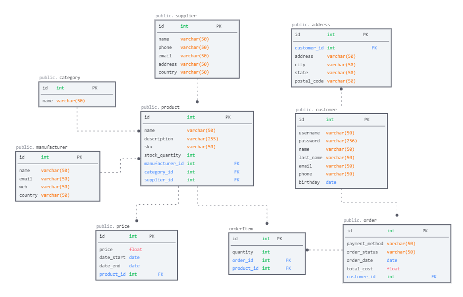

## Проектирование БД

### Схема базы данных

### Описание таблиц

#### product
Описание: таблица товаров

| Поле             | Описание                     | Пример |
|------------------|------------------------------|--------|
| id               | номер записи                 | 1                                      |
| name             | наименование                 | Ноутбук                                |
| description      | описание                     | Аллюминий, Win 10, SSD 500Gb, ОЗУ 16Gb |
| sku			   | арктикул					  | 4567809        |
| stock_quantity   | количество товара на складе  | 5       |
| category_id      | катгория                     | 1       |
| supplier_id      | поставщик                    | 1       |
| manufacturer_id  | производитель                | 1       | 

#### category
Описание: таблица категорий товара

| Поле      | Описание                    | Пример  |
|-----------|-----------------------------|---------|
| id        | номер записи                | 1       |
| name      | наименование категории      | Ноутбуки|

#### price
Описание: таблица цены товара

| Поле       | Описание                     | Пример   |
|------------|------------------------------|----------|
| id         | номер записи                 | 1        |
| product_id | продукт                      | A320NEO  |
| price      | цена                         | RA-77734 |
| date_start | дата начала цены             | Utair    |
| date_end   | дата окончания цены          | Utair    |

#### supplier
Описание: таблица поставщиков

| Поле      | Описание          | Пример                          |
|-----------|-----------------  |---------------------------------|
| id        | номер записи      | 1                               |
| name      | наименование      | ООО НИКС                        |
| phone     | телефон           | +79991110000                    |
| email     | электронный адрес | sales@nix.ru                    |
| address   | адрес             | Москва, ул. Дмитриевская, д. 50 |
| country   | страна            | Россия                          |

#### manufacturer
Описание: таблица производителей

| Поле      | Описание          | Пример         |
|-----------|---------------  --|----------------|
| id        | номер записи      | 1              |
| name      | наименование      | Asus           |
| email     | электронный адрес | sales@asus.com |
| web       | сайт              | www.asus.com   |
| country   | страна            | США            |

#### customer
Описание: таблица покупателей

| Поле       | Описание            | Пример             |
|------------|---------------------|--------------------|
| id         | номер записи        | 1                  |
| username   | логин               | maksov             | 
| password   | пароль              |                    |
| name       | имя                 | Максим             |
| last_name  | фамилия             | Овчинников         |
| email      | электронный адрес   | classic12@list.ru  |
| phone      | имя                 | +79224350000       |
| birthday   | дата рождения       | 21.01.1990         |

#### address
Описание: таблица адресов покупателей

| Поле        | Описание                                 | Пример                |
|-------------|------------------------------------------|-----------------------|
| id          | номер записи                             | 1                     |
| customer_id | покупатель                               | 1                     |
| address     | адрес(улица, дом, кв)                    | Чапаева, дом 5, кв 45 |
| city        | населенный пункт                         | Югорск                |
| state       | регион                                   | ХМАО-Югра             |
| postal_code | индекс                                   | 628260                |

#### order
Описание: таблица заказов

| Поле           | Описание                                 | Пример      |
|----------------|------------------------------------------|-------------|
| id             | номер записи                             | 1           |
| payment_method | метод оплаты                             | карта       |
| order_status   | статус заказа                            | новый       |
| order_date     | дата заказа                              | 11.03.2024  |
| total_cost     | стоимость заказа                         | 60700       |
| customer_id    | покупатель                               | 1           |

#### orderItem
Описание: таблица продуктов заказа

| Поле           | Описание                                 | Пример              |
|----------------|------------------------------------------|---------------------|
| id             | номер записи                             | 1                   |
| order_id       | заказ                                    | 1                   |
| product_id     | продукт                                  | 1                   |
| quantity       | количество                               | 1                   |

