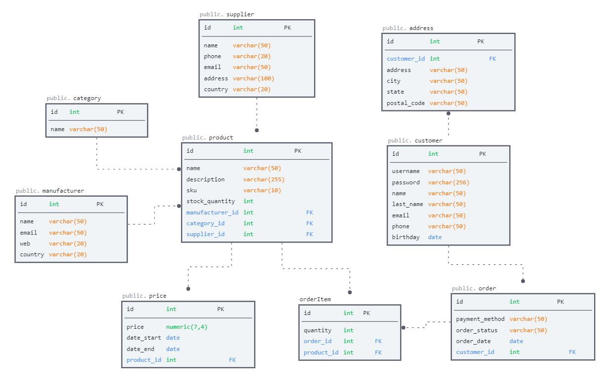

## Проектирование БД

### Схема базы данных



### Выборка данных

### Описание таблиц

#### product
Описание: таблица товаров

| Поле             | Описание                     | Тип           | Пример                                 |
|------------------|------------------------------|---------------|----------------------------------------|
| id               | номер записи                 | serial        | 1                                      |
| name             | наименование                 | varchar(50)   | Ноутбук                                |
| description      | описание                     | varchar(255)  | Аллюминий, Win 10, SSD 500Gb, ОЗУ 16Gb |
| sku			   | арктикул					  | varchar(10)   | 4567809                                |
| stock_quantity   | количество товара на складе  | int           | 5                                      |
| category_id      | катгория                     | int           | 1                                      |
| supplier_id      | поставщик                    | int           | 1                                      |
| manufacturer_id  | производитель                | int           | 1                                      | 


```sql
create table product (
	id serial PRIMARY KEY,
	name varchar(50) NOT NULL,
	description varchar(255) NOT NULL,
	sku varchar(10) NOT NULL UNIQUE,
	stock_quantity int NOT NULL,
	category_id int,
	supplier_id int,
	manufacturer_id int,
	CONSTRAINT fk_category
      FOREIGN KEY(category_id) 
	  REFERENCES category(id)
	  ON DELETE CASCADE,
	CONSTRAINT fk_supplier
      FOREIGN KEY(supplier_id) 
	  REFERENCES category(id)
	  ON DELETE SET NULL,
	CONSTRAINT fk_manufacturer
      FOREIGN KEY(manufacturer_id) 
	  REFERENCES category(id)
	  ON DELETE SET NULL, 
);
create index idx_product_name on product (name);
create index idx_product_sku on product (sku);

comment on column product.name is 'Название товара. 50 символов. Индекс для повышения производительности по поиску товара по имени';
comment on column product.sku is 'Артикул товара. 10 символов. Индекс для повышения производительности по поиску товара по индексу';
comment on column product.sku is 'Категория. Внешний ключ по id категории. При удалении категории будут удаляться товары этой категории';

```

#### category
Описание: таблица категорий товара

| Поле      | Описание                    | Тип         | Пример  |
|-----------|-----------------------------|-------------|---------|
| id        | номер записи                | serial      | 1       |
| name      | наименование категории      | varchar(50) | Ноутбуки|

```sql
create table product (
	id serial PRIMARY KEY,
	name varchar(50) NOT NULL UNIQUE  
);
create index idx_category_name on category (name);
comment on column category.name is 'Название категории. 50 символов. Индекс для повышения производительности по поиску категории по имени';
```

#### price
Описание: таблица цены товара

| Поле       | Описание                     | Тип           | Пример     |
|------------|------------------------------|---------------|------------|
| id         | номер записи                 |  serial       | 1          |
| product_id | продукт                      |  int          | 1          |
| price      | цена                         |  numeric(7,4) | 70000      |
| date_start | дата начала цены             |  date         | 01.01.2024 |
| date_end   | дата окончания цены          |  date         | Null       |
```sql
create table price (
	id serial PRIMARY KEY,
	price numeric(7,4) NOT NULL,
	description varchar(255) NOT NULL,
	sku varchar(10) NOT NULL UNIQUE,
	stock_quantity int NOT NULL,
	product_id int,
	CONSTRAINT fk_price_product_id
      FOREIGN KEY(product_id) 
	  REFERENCES product(id)
	  ON DELETE CASCADE
);

comment on column price.product_id is 'Внешний ключ с таблицей product по ключу product(id). Каскадное удаление (удаление родительской сущности удаляет связанные дочерние сущности)';

```

#### supplier
Описание: таблица поставщиков

| Поле      | Описание          | Тип          | Пример                          |
|-----------|-------------------|--------------|---------------------------------|
| id        | номер записи      | serial       | 1                               |
| name      | наименование      | varchar(50)  | ООО НИКС                        |
| phone     | телефон           | varchar(20)  | +79991110000                    |
| email     | электронный адрес | varchar(50)  | sales@nix.ru                    |
| address   | адрес             | varchar(100) | Москва, ул. Дмитриевская, д. 50 |
| country   | страна            | varchar(20)  | Россия                          |

```sql
create table supplier (
	id serial PRIMARY KEY,
	name varchar(50) NOT NULL,
	phone varchar(20) NOT NULL,
	email varchar(50) NOT NULL,
	address varchar(100) NOT NULL,
	country varchar(20) NOT NULL,
);
create index idx_supplier_name on supplier (name);
comment on column supplier.name is 'Наименование поставщика. 50 символов. Индекс для повышения производительности по поиску поставщика по наименованию';
```

#### manufacturer
Описание: таблица производителей

| Поле      | Описание          |  Тип              | Пример         |
|-----------|-------------------|-------------------|----------------|
| id        | номер записи      |  serial           | 1              |
| name      | наименование      |  varchar(50)      | Asus           |
| email     | электронный адрес |  varchar(50)      | sales@asus.com |
| web       | сайт              |  varchar(20)      | www.asus.com   |
| country   | страна            |  varchar(20)      | США            |

```sql
create table manufacturer (
	id serial PRIMARY KEY,
	name varchar(50) NOT NULL,
	email varchar(50) NOT NULL,
	web varchar(20) NOT NULL,
	country varchar(20) NOT NULL,
);
create index idx_manufacturer_name on manufacturer(name);
comment on column manufacturer.name is 'Наименование производителя. 50 символов. Индекс для повышения производительности по поиску производителя по наименованию';
```

#### customer
Описание: таблица покупателей

| Поле       | Описание            | Тип                | Пример             |
|------------|---------------------|--------------------|--------------------|
| id         | номер записи        | serial             | 1                  |
| username   | логин               | varchar(50)        | maksov             | 
| password   | пароль              | varchar(50)        |                    |
| name       | имя                 | varchar(50)        | Максим             |
| last_name  | фамилия             | varchar(50)        | Овчинников         |
| email      | электронный адрес   | varchar(50)        | classic12@list.ru  |
| phone      | имя                 | varchar(12)        | +79224350000       |
| birthday   | дата рождения       | date               | 21.01.1990         |

```sql
create table customer (
	id serial PRIMARY KEY,
	username varchar(50) NOT NULL UNIQUE,
	password varchar(256) NOT NULL,
	name varchar(50) NOT NULL,
	last_name varchar(50) NOT NULL,
	email varchar(50) NOT NULL UNIQUE,
	phone varchar(12) NOT NULL,
	birthday date NOT NULL
	
);
create index idx_customer_name on  customer(username);
create index idx_customer_fio on  customer(name, last_name);
comment on column customer.username is 'Логин пользователя. 50 символов. Индекс для повышения производительности по поиску пользователя по логину';
comment on column customer.name is 'Имя пользователя. 50 символов. Композитный индекс для повышения производительности по поиску пользователя по имени и фамилии';
```

#### address
Описание: таблица адресов покупателей

| Поле        | Описание                                 |  Тип             | Пример                |
|-------------|------------------------------------------|------------------|-----------------------|
| id          | номер записи                             |  serial          | 1                     |
| customer_id | покупатель                               |  int             | 1                     |
| address     | адрес(улица, дом, кв)                    |  varchar(100)    | Чапаева, дом 5, кв 45 |
| city        | населенный пункт                         |  varchar(50)     | Югорск                |
| state       | регион                                   |  varchar(50)     | ХМАО-Югра             |
| postal_code | индекс                                   |  int             | 628260                |

```sql
create table address (
	id serial PRIMARY KEY,
	address varchar(100) NOT NULL,
	city varchar(50) NOT NULL,
	state varchar(50) NOT NULL,
	postal_code int NOT NULL,
	customer_id int,
	CONSTRAINT fk_customer_address
      FOREIGN KEY(customer_id) 
	  REFERENCES customer(id)
	  ON DELETE CASCADE
	
);
create index idx_address_adr on address(state, city, address);

comment on column address.state is 'Регион.  Композитный индекс для повышения производительности по поиску адреса по полям state, city, address';
comment on column address.customer_id is 'Внешний ключ с таблицей customer по ключу customer(id).  Каскадное удаление (удаление родительской сущности удаляет связанные дочерние сущности)';
```

#### order
Описание: таблица заказов

| Поле           | Описание                                 |  Тип          | Пример      |
|----------------|------------------------------------------|---------------|-------------|
| id             | номер записи                             |  serial       | 1           |
| payment_method | метод оплаты                             |  varchar(10)  | карта       |
| order_status   | статус заказа                            |  varchar(10)  | новый       |
| order_date     | дата заказа                              |  date         | 11.03.2024  |
| customer_id    | покупатель                               |  int          | 1           |

```sql
create table order (
	id serial PRIMARY KEY,
	payment_method varchar(10) NOT NULL,
	order_status varchar(10) NOT NULL,
	order_date date NOT NULL,
	customer_id int,
	CONSTRAINT fk_customer_order
      FOREIGN KEY(customer_id) 
	  REFERENCES customer(id)
	  ON DELETE SET NULL	
);
create index idx_order_date on order(date);
comment on column order.date is 'Дата заказа.  Ключ для ускорения поиска по дате';
comment on column order.customer_id is 'Внешний ключ с таблицей customer по полю customer(id). Удаление ON DELETE SET NULL будет устанавливать нулевые значения в дочерней таблице при удалении элементов в родителской сущности';
```

#### orderItem
Описание: таблица продуктов заказа

| Поле           | Описание                | Тип         | Пример              |
|----------------|-------------------------|-------------|---------------------|
| id             | номер записи            | serial      | 1                   |
| order_id       | заказ                   | int         | 1                   |
| product_id     | продукт                 | int         | 1                   |
| quantity       | количество              | int         | 1                   |

```sql
create table orderItem (
	id serial PRIMARY KEY,
	order_id int,
	product_id int,
	quantity int,
	CONSTRAINT fk_order_id
      FOREIGN KEY(order_id) 
	  REFERENCES order(id)
	  ON DELETE CASCADE,
	 CONSTRAINT fk_product_id
      FOREIGN KEY(product_id) 
	  REFERENCES product(id)
	  ON DELETE SET NULL
);
comment on column orderItem.customer_id is 'Внешний ключ с таблицей order по полю order(id).  Каскадное удаление (удаление родительской сущности удаляет связанные дочерние сущности)';
comment on column orderItem.product_id is 'Внешний ключ с таблицей product по полю product(id). Удаление ON DELETE SET NULL будет устанавливать нулевые значения в дочерней таблице при удалении элементов в родителской сущности';
```


## Примеры бизнес-задач

### Управление продуктами

- Добавление, изменение и удаление продуктов, категорий продуктов, цен и поставщиков
- Получение списка продуктов в определенной категории
- Получение списка цен на определенный продукт за определенный период времени
- Получение информации о поставщиках продуктов

### Управление покупками

- Добавление информации о покупках и покупателях
- Получение списка покупок определенного покупателя
- Получение средней стоимости покупок за определенный период времени
- Определение наиболее популярных продуктов и категорий продуктов среди покупателей

### Аналитика и отчетность

- Получение отчетов о продажах по продуктам, категориям продуктов, поставщикам и периодам времени
- Оценка эффективности поставщиков и производителей на основе объема продаж
- Мониторинг цен на конкурирующие продукты и анализ изменений рынка

