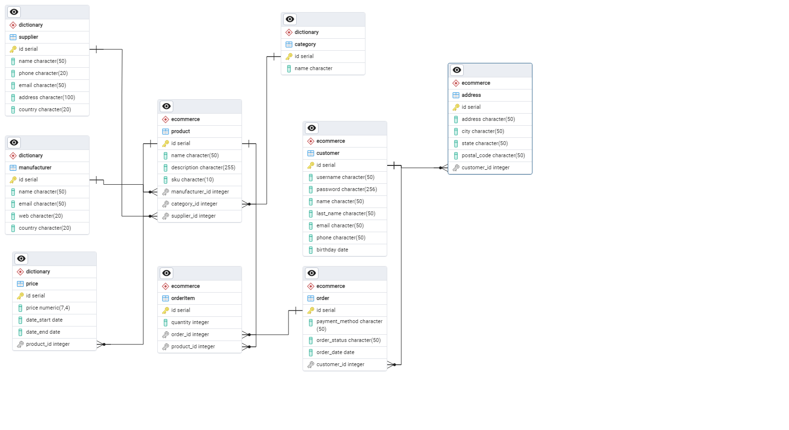

## Проектирование БД

### Схема базы данных



### Создание базы данных

Создана БД для проекта DBShoppOnline

```
CREATE DATABASE "DBShopOnline"
    WITH
    OWNER = postgres
    ENCODING = 'UTF8'
    LC_COLLATE = 'en_US.utf8'
    LC_CTYPE = 'en_US.utf8'
    LOCALE_PROVIDER = 'libc'
    TABLESPACE = pg_default
    CONNECTION LIMIT = -1
    IS_TEMPLATE = False;

GRANT TEMPORARY, CONNECT ON DATABASE "DBShopOnline" TO PUBLIC;

GRANT ALL ON DATABASE "DBShopOnline" TO postgres;
```


### Создание схем данных

В результате анализа схемы базы данных проведено разделение таблиц по трем схем данных:

- dictionary - в данной схеме хранятся таблицы, в которых хранится справочная информация

```
CREATE SCHEMA IF NOT EXISTS dictionary
    AUTHORIZATION postgres;
```

- profile - в схеме хранятся таблицы, относящиеся к профилю заказчика (пользователя)

- ecommerce - основная схема, в которой хранятся таблицы заказов


### Создание таблиц

На даннома этапе создаются таблицы согласно приведенной схеме БД.

Пример создания таблицы
```
CREATE TABLE IF NOT EXISTS dictionary.supplier
(
    id serial NOT NULL,
    name character(50) NOT NULL,
    phone character(20) NOT NULL,
    email character(50),
    address character(100),
    country character(20),
    PRIMARY KEY (id)
);
```


### Создание ролей БД и представление дсотупов

Роли БД

shopuser_reader - роль для чтения таблиц

shopuser_writer - роль для записи в таблицы

dictionary_admin - роль для заполнения 

```
CREATE ROLE dictionary_admin WITH
  NOLOGIN
  NOSUPERUSER
  INHERIT
  NOCREATEDB
  NOCREATEROLE
  NOREPLICATION
  NOBYPASSRLS;

GRANT CONNECT ON DATABASE "DBShopOnline" TO dictionary_admin;

GRANT ALL ON TABLE dictionary.category TO dictionary_admin;

GRANT ALL ON TABLE dictionary.manufacturer TO dictionary_admin;

GRANT ALL ON TABLE dictionary.price TO dictionary_admin;

GRANT ALL ON TABLE dictionary.supplier TO dictionary_admin;
```

shop_admin - роль для администрирования системы


